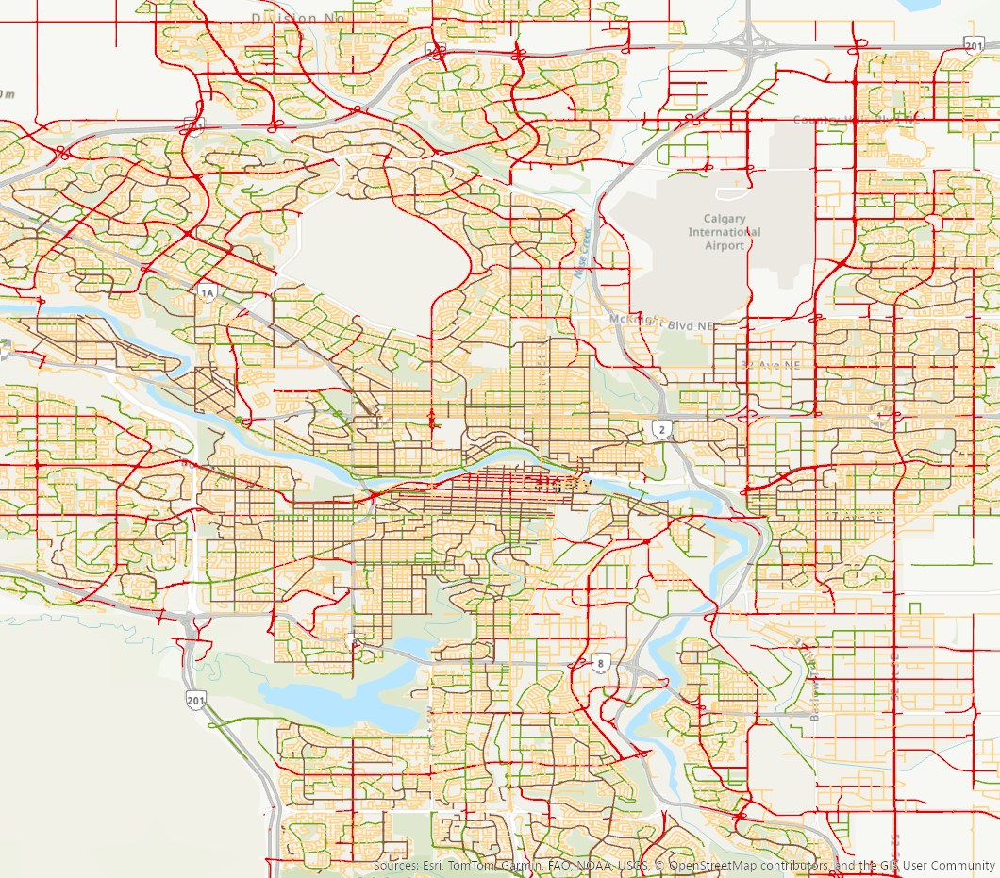

# Calgary Bike Lane Suitability Analysis

A multi-criteria GIS analysis to score every road segment in Calgary for bike lane potential, using ArcGIS Pro and Python (ArcPy).

## Map Output

**Score classification:**
- 🔴 23–40 Low — insufficient road width for a bike lane
- 🟠 41–80 Moderate — room for 1 bike lane
- 🟢 81–100 High — room for 2 bike lanes

## Methodology

Each road segment is scored on three criteria weighted by the North Bend Exponential Ranking method:

| Criterion | Weight | Rationale |
|---|---|---|
| Road width (excess over car lanes) | **84%** | Primary physical constraint for bike lanes |
| Slope (from 25 m DEM) | **13%** | Steeper grades discourage cycling |
| Speed limit | **3%** | Safer at lower speeds; even fast roads can have protected lanes |

**Final score = 0.84 × width_score + 0.13 × slope_score + 0.03 × speed_score**

### Scoring Rules

**Width score** — based on excess width after subtracting car lane space (3.5 m/lane) and minimum bike lane space (3 m for 2 lanes):

| Excess width | Score |
|---|---|
| ≥ 0 m | 100 |
| −1.5 to 0 m | 50 |
| −3 to −1.5 m | 25 |
| < −3 m | 0 |

**Slope score:**

| Grade | Score |
|---|---|
| 0–3.5% | 100 (flat, comfortable) |
| 3.5–6.5% | 50 (manageable) |
| > 6.5% | 0 (too steep) |

**Speed score:**

| Speed limit | Score |
|---|---|
| ≤ 40 km/h | 100 |
| 41–70 km/h | 75 |
| > 70 km/h | 50 |

## Data Sources

| Dataset | Source |
|---|---|
| Street Centreline | [Calgary Open Data](https://data.calgary.ca) |
| Existing Bikeways | [Calgary Open Data](https://data.calgary.ca) |
| 25 m DEM (slope) | City of Calgary |
| City Boundary | [Calgary Open Data](https://data.calgary.ca) |

## Tools

- **ArcGIS Pro** — spatial analysis, map production, layout export
- **Python (ArcPy)** — automated scoring pipeline (5 scripts)
- **Calgary Open Data Portal** — all input datasets

## Scripts

| Script | Description |
|---|---|
| `01_prepare_roads.py` | Project road centrelines to UTM, join attributes |
| `02_slope.py` | Extract slope statistics from 25 m DEM to each road segment |
| `03_score.py` | Calculate width, slope, and speed scores; compute weighted final score |
| `04_sensitivity.py` | Test score stability under alternative weight scenarios |
| `05_validate.py` | Cross-check scored segments against existing bikeways |

## Author

Yujia Zhang | MEng Geomatics, University of Calgary | Calgary, AB

> See also: [Calgary Transit-Accessible Parks](https://github.com/chloechloe-a11y/calgary-transit-trailheads)
